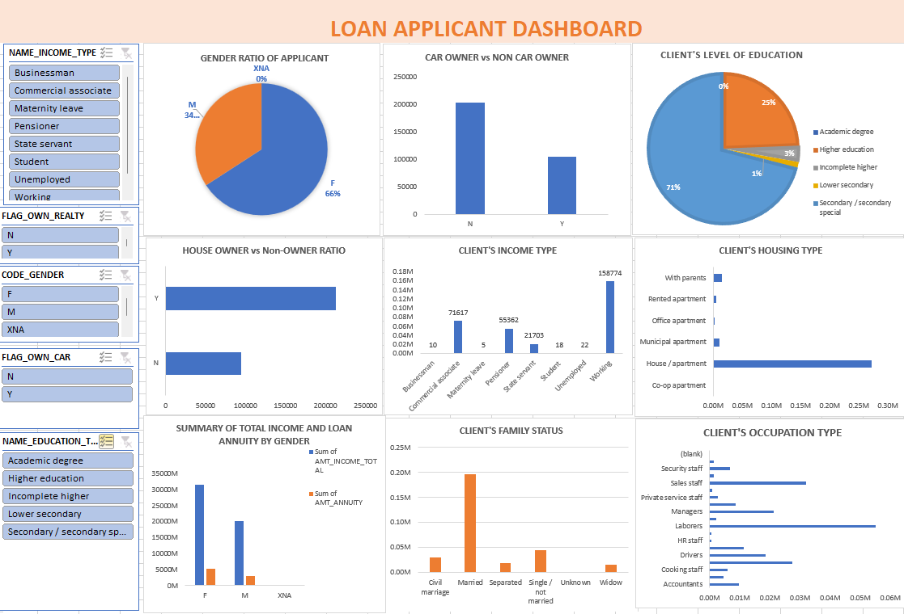

# Loan_Applicant_Analysis

## Introduction

This is an Excel project on loan applicant aimed at analyzing the applicant information based on a variety of characterstics. The goal of the project is to develop an interactive dashboard to discover relevant insights.

## Problem Satement

* Gender Ratio of Applicants
* Car Owner/ Non-Owner Ratio
* House Owner/ Non-Owner Ratio
* Client Income Type
* Client’s Level of Education
* Client’s Housing Type
* Client’s Family Status
* Client’s Occupation Type
* Total Income and Loan Annuity by gender

## Tools

* Power query editor to prepare the data for analysis
* Pivot table to analyze and summarize the data
* Pivot Chart to visualize the report.

## Visualization

